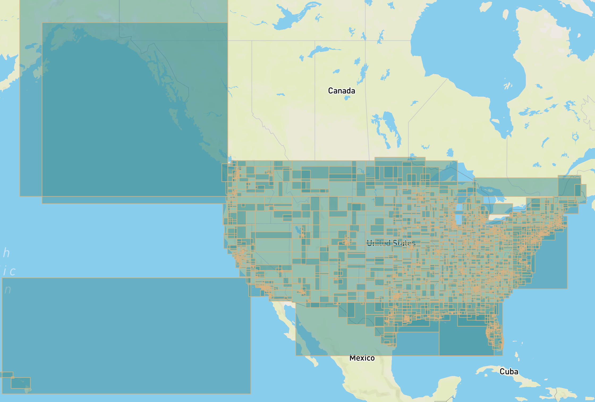

# Exploring spatially-partitioned GeoParquet

## Install

Using Poetry:

```
poetry install
```

This will install packages from the lockfile and ensure that you're using the exact same environment of packages as me.

## Spatially partitioning the data

### Preprocessing

#### Step 1: Download data

Download source files from Microsoft's website:

```bash
> mkdir -p data/source/
# With 8 threads:
> cat files.txt | xargs -n 1 -P 8 wget -q -P data/source/
```

#### Step 2: Preprocess data

The data are distributed by Microsoft in zipped GeoJSON, which is not a performant format to load. To make later steps faster, we'll convert all the input files into Parquet. This uses the `osgeo/gdal:latest` image (as of May 7, 2022) for simplicity.

```bash
cd data
mkdir -p preprocessed
for file in $(ls source/*.zip); do
  state=$(basename $file .geojson.zip)
  echo $state
  docker run --rm -it -v $(pwd):/data osgeo/gdal:latest \
    ogr2ogr \
    /data/preprocessed/$state.parquet \
    /vsizip//data/$file \
    -lco COMPRESSION=ZSTD
done
cd ..
```

Takes ~1 hour on my computer.

### Results

```
poetry run python visualize_bounds.py --input data/manual-hilbert-shuffle/shuffled.parquet
```



<center>Hilbert values with 2000 equal partitions</center>
